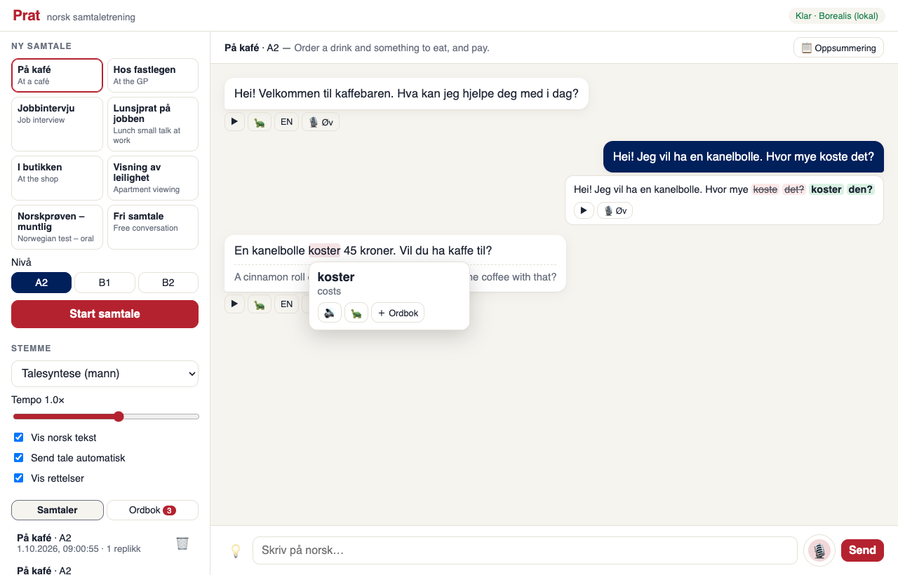

# Prat — norsk samtaletrening

Practise **spoken Norwegian (bokmål)** by role-playing everyday situations with an AI
partner. Everything runs locally on a Mac: the partner speaks through Norwegian TTS
voices, listens through the National Library's Norwegian Whisper, and gently corrects you.



## Quick start

```bash
./run.sh            # first run downloads ~6 GB of models, then open http://127.0.0.1:8000
```

Requires [uv](https://docs.astral.sh/uv/) and an Apple-silicon Mac (the local LLM uses MLX).
On other machines, set `PRAT_LLM=claude` (or `scripted`). The other models also run on CPU.

## What you can do

- **8 scenarios**: café, GP, job interview, lunch small talk, shop, apartment viewing,
  *Norskprøven* oral exam, free conversation. **Levels A2 / B1 / B2**.
- **Talk or type.** Click 🎙 or hold <kbd>space</kbd>. Turn off *Send tale automatisk* to
  review or edit the transcript before sending.
- **Corrections** under each of your messages, as a word diff (struck = wrong, green = fix).
- **Listening practice**: replay, 🐢 slow replay, *EN* translation, and *Vis norsk tekst*
  off to hide the text until you tap it.
- **Tap any word** to hear it, see its meaning in context and save it to the **Ordbok**.
- **💡 Hjelp meg** suggests three things you could say next.
- **🎙 Øv (shadowing)** — hear a sentence, say it, get a word-by-word score.
- **📋 Oppsummering** — every correction from the conversation, with practice buttons.
- 12 voices: Talesyntese, 10 NVCC speakers (male/female, several regional codes), and MMS.

## Models

| Role | Model | Notes |
|---|---|---|
| TTS | Piper `no_NO-talesyntese-medium` | default; clearest; ~0.25 s per sentence on CPU |
| TTS | Piper `no_NO-nvcc-medium` (10 speakers) | K = kvinne, M = mann (checked by pitch); the suffix is a regional code from the dataset |
| TTS | Meta MMS VITS bokmål (`thomasht86/mms-tts-nob`) | experimental, noticeably less accurate |
| STT | `NbAiLab/nb-whisper-small` | ~1–2 s per utterance on the M1 GPU |
| Partner | `NbAiLab/borealis-4b-instruct-preview-mlx-8bit` | local Norwegian LLM, ~1.5–3 s per reply |
| Partner | Claude (`claude-opus-5-5`) | used automatically when `ANTHROPIC_API_KEY` is set |

The partner works in small, separate tasks (reply → then feedback / translation /
gloss / suggestions on demand), so the spoken reply arrives first and a 4B model stays reliable.

## Configuration (env vars)

| Var | Default | |
|---|---|---|
| `PRAT_LLM` | `auto` | `auto` (Claude if credentials, else Borealis, else scripted) · `claude` · `mlx` · `scripted` |
| `PRAT_MLX_MODEL` | `NbAiLab/borealis-4b-instruct-preview-mlx-8bit` | try `…-1b-…` for speed, `…-12b-…-8bit` for quality |
| `PRAT_STT_MODEL` | `NbAiLab/nb-whisper-small` | `nb-whisper-base` is ~3× faster, `-medium` more accurate |
| `PRAT_VOICE` | `piper:talesyntese` | default voice id |
| `PRAT_CLAUDE_MODEL` | `claude-opus-5-5` | |
| `PRAT_DATA_DIR` / `PRAT_MODELS_DIR` | `./data` / `./models` | SQLite DB / Piper voices |

`./run.sh --host 0.0.0.0 --port 8000` to use it from a phone on the same network. Note that browsers
only allow the microphone on `localhost` or HTTPS.

## Layout

```
prat/
  tts.py        Piper + MMS engines, voice registry, WAV cache
  stt.py        NB-Whisper (transformers, MPS)
  llm.py        tutoring prompts + parsing; Claude / Borealis-MLX / scripted backends
  scenarios.py  role-play scenarios and level descriptions
  scoring.py    shadowing word alignment
  store.py      SQLite: sessions, turns, vocab
  server.py     FastAPI API + static UI
web/            vanilla JS UI; recorder.js captures 16 kHz WAV in the browser (no ffmpeg)
tests/          pytest (fake engines) + e2e/ui_smoke.py (headless browser, real models)
```

## Tests

```bash
uv run pytest                                   # fast unit/API tests, no models
./run.sh --port 8765 & uv run python tests/e2e/ui_smoke.py   # full UI with real models
```

## Known limitations

- **Whisper smooths over inflection errors.** It tends to transcribe *"koste"* as *"koster"* and
  *"eple"* as *"epler"*, so spoken mistakes in endings can go unnoticed. Word order survives, and
  typed text is checked exactly. The `-verbatim` NB-Whisper models behaved the same in testing.
- **Local explanations are hidden.** Borealis 4B makes good corrections but often explains them
  wrongly, so with the local model you see only the corrected sentence. Claude adds explanations.
- The Claude backend is unit-tested against the API request shape but has not been run against the
  live API from this machine (no key was configured).
- Pronunciation scoring is word-level (did the recogniser understand you), not phoneme-level.
