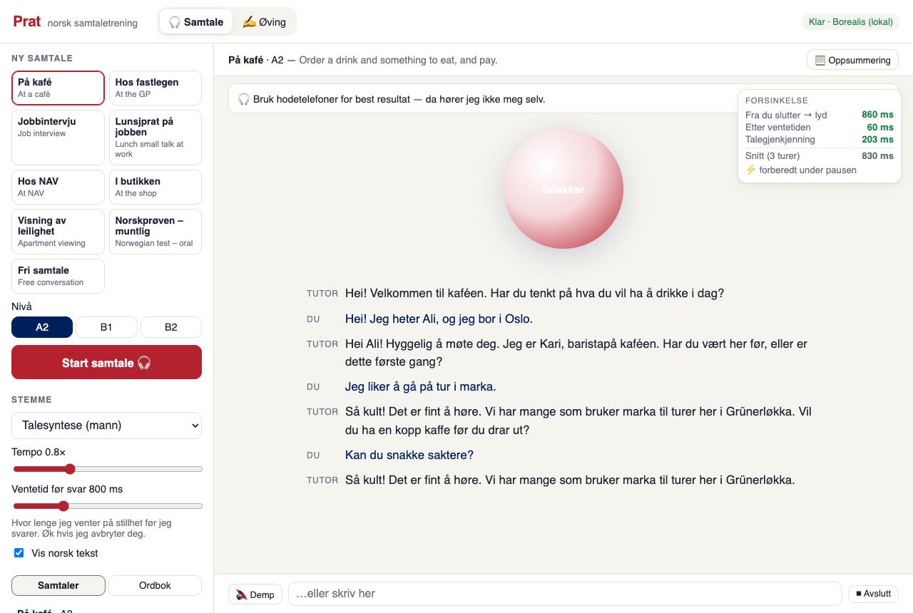
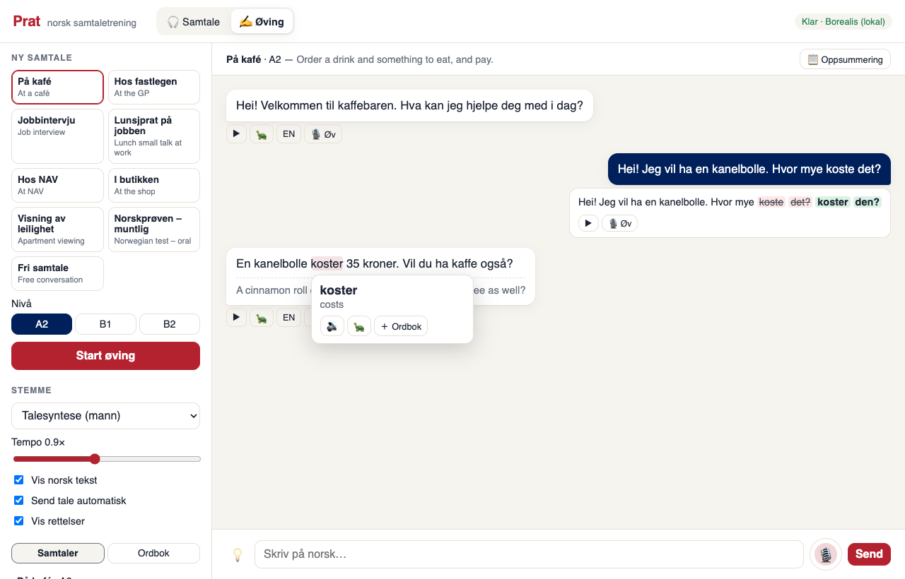

# Prat 🇳🇴 — a local Norwegian conversation partner

**Prat** (Norwegian for "chat") lets you practise *spoken* Norwegian by just talking.
It listens, waits until you've finished (even when you pause to find a word), and answers
out loud in about a second. Start talking and it stops to listen. Everything runs locally
on your Mac: no accounts, no API keys, and no internet once the models are downloaded.



It's built from open Norwegian models:

| | Model | From |
|---|---|---|
| 👂 Hearing | [NB-Whisper](https://huggingface.co/NbAiLab/nb-whisper-small) (small, MLX build) | National Library of Norway |
| 🧠 Thinking | [Borealis 4B instruct](https://huggingface.co/NbAiLab/borealis-4b-instruct-preview-mlx-8bit) | National Library of Norway |
| 🗣️ Speaking | [Piper](https://github.com/OHF-Voice/piper1-gpl) voices `talesyntese` and `nvcc` (10 speakers) | trained on Språkbanken data |
| ⏱️ Turn-taking | [Silero VAD](https://github.com/snakers4/silero-vad) | Silero |

## Requirements

- A Mac with **Apple silicon** (M1 or newer). The models run on [MLX](https://github.com/ml-explore/mlx).
- **16 GB of memory** minimum; more is better (see [Performance](#performance)).
- About **6 GB of free disk** for the models.
- [**uv**](https://docs.astral.sh/uv/), which manages Python and the dependencies:
  `curl -LsSf https://astral.sh/uv/install.sh | sh`
- **Chrome** is recommended (for its echo cancellation). **Headphones** are recommended too.

## Quick start

```bash
git clone https://github.com/alirezaelahi/norsk-prat.git
cd norsk-prat
./run.sh
```

The first run installs the dependencies and downloads the models (about 5 GB, once). The app then
opens at <http://127.0.0.1:8000>. Wait until the status pill says **Klar**, then press the orb and say hei.

Prefer the individual steps?

```bash
uv sync            # install dependencies into .venv
uv run prat setup  # download all models (safe to re-run)
uv run prat --open # start the server and open the browser
```

## Two ways to practise

### 🎧 Samtale — live conversation (default)

Hands-free, continuous conversation, like talking to a person.

- **Pick a situation and level** on the left: café, GP, NAV, job interview, lunch small talk, shop,
  apartment viewing, the *Norskprøven* oral exam, or free conversation. Levels are A2, B1 and B2.
- **Just talk.** The orb shows whose turn it is. If the tutor cuts in while you're thinking, drag
  **Ventetid før svar** (silence before it answers) to the right.
- **Interrupt any time.** Start speaking and the tutor stops; it remembers only what you actually heard.
- **Say what you need:**
  - *"Kan du gjenta?"* repeats the last line
  - *"Snakk saktere"* / *"fortere"* changes the speaking speed
  - *"Hva betyr dagpenger?"* / *"Forklar …"* explains a word
  - *"La oss øve på jobbintervju"* switches the role-play
- **Gentle corrections.** The tutor repeats what you meant, correctly, instead of lecturing.
- Tap any word in the transcript to hear it, see what it means and save it to your **Ordbok**.
- **📋 Oppsummering** lists the corrections from the conversation.
- The **latency panel** shows where each turn's time went.

### ✍️ Øving — practice mode

A slower chat for deliberate practice. Speak (click the mic or hold <kbd>space</kbd>) or type.

- Each message gets a **correction** shown as a word diff.
- Partner replies come with **replay**, 🐢 **slow** replay and **EN** translation.
- **💡** suggests three things you could say next.
- **🎙 Øv (shadowing):** hear a sentence, say it, get a word-by-word score.



## How it works

```
mic ─▶ Silero VAD ─▶ turn detector ─▶ NB-Whisper ─▶ Borealis (streaming) ─▶ sentence chunker ─▶ Piper ─▶ 🔊
                          ▲                                                                       │
                          └──────────────── barge-in: your voice cancels the reply ───────────────┘
```

Three tricks keep it fast:

1. **Speculation.** When you go quiet, it starts transcribing and drafting a reply straight away,
   but holds the audio back. If you stay quiet long enough, the reply is already there. If you
   keep talking, the draft is thrown away.
2. **Prompt caching.** The conversation so far stays in the model's memory between turns, so
   only your newest words have to be processed (~250 ms to the first word).
3. **Streaming.** The first sentence is spoken while the rest is still being written.

The details, including the message protocol, are in [docs/architecture.md](docs/architecture.md).
The design goals and measured results are in [docs/design.md](docs/design.md).

## Performance

Measured on an M1 Pro with 16 GB, using synthetic speech streamed in real time:

| | Target | Measured |
|---|---|---|
| You stop speaking → tutor's voice | ≤ 1.0 s | **~0.8–1.0 s** typical (800 ms of that is the deliberate wait) |
| Tutor stops when you interrupt | ≤ 200 ms | **~90–180 ms** after your speech is confirmed |
| Model: first word of the reply | < 300 ms | **~250 ms** |

On 16 GB, having many other apps open can push the Mac into swap, and replies slow to 2 s or
more. With more memory you can switch to bigger models, which give better Norwegian:

```bash
PRAT_STT_MODEL=FredrikKarlssonSpeech/nb-whisper-medium-mlx \
PRAT_MLX_MODEL=NbAiLab/borealis-12b-instruct-preview-mlx-8bit \
./run.sh
```

## Configuration

All settings are optional environment variables:

| Variable | Default | |
|---|---|---|
| `PRAT_MLX_MODEL` | `NbAiLab/borealis-4b-instruct-preview-mlx-8bit` | conversation model (any MLX chat model or local folder) |
| `PRAT_STT_MODEL` | `FredrikKarlssonSpeech/nb-whisper-small-mlx` | speech recognition (`…-medium-mlx` is more accurate, slower) |
| `PRAT_VOICE` | `piper:talesyntese` | default voice (others can be picked in the UI) |
| `PRAT_SPEED` | `0.9` | default speaking speed |
| `PRAT_END_MS` | `800` | default silence (ms) before the tutor answers |
| `PRAT_DATA_DIR` | `./data` | conversation history and word list (SQLite) |
| `PRAT_MODELS_DIR` | `./models` | Piper voices and the Silero VAD |

Command-line options: `uv run prat --help` (`--port`, `--host`, `--open`).
Microphone access only works on `localhost` or over HTTPS, so use the app on the Mac it runs on.

## Project layout

```
prat/
  __main__.py      `prat` command: setup / serve
  server.py        FastAPI: REST API for practice mode, WebSocket /ws/live for live mode
  models.py        model downloads, offline mode, warm-up
  live/            real-time pipeline
    session.py       orchestration: turns, speculation, barge-in, history, metrics
    turn.py          end-of-turn and barge-in detection (pure state machine)
    vad.py           Silero VAD on onnxruntime
    chunker.py       LLM tokens → speakable sentences
    tutor.py         system prompt, voice commands, "unfinished sentence" heuristic
  local_lm.py      Borealis on MLX with a reusable prompt cache
  stt.py           NB-Whisper on MLX
  tts.py           Piper voices
  practice.py      practice-mode tasks: reply, feedback, translation, glossary, suggestions
  scenarios.py     role-play situations and levels
  scoring.py       shadowing score
  store.py         SQLite storage
web/               the UI (plain HTML/CSS/JS, no build step)
tests/             unit tests (fast, no models) and e2e/ (real models)
```

## Development

```bash
uv run pytest                    # unit tests: fast, no models needed
uvx ruff check . && uvx ruff format --check .
```

The end-to-end tests drive the real models against a running server:

```bash
uv sync --group e2e && uv run playwright install chromium
uv run prat --port 8765 &
uv run python tests/e2e/live_client.py      # real-time latency + barge-in report
uv run python tests/e2e/live_ui_smoke.py    # live mode in a headless browser
uv run python tests/e2e/ui_smoke.py         # practice mode in a headless browser
```

## Known limitations

- **Echo with laptop speakers hasn't been tested** with a real microphone; it relies on the
  browser's echo cancellation. Use headphones.
- **Whisper tidies up word endings.** It tends to hear *"koste"* as *"koster"*, so some grammar
  mistakes aren't caught. Word-order mistakes come through.
- The 4B model occasionally slips (a typo, or repeating a learner's error back). The 12B model is better
  if you have the memory.
- Pronunciation scoring is word-level ("was I understood"), not phoneme-level.

## Credits

Prat was built with [Claude Code](https://claude.com/claude-code), from an idea and design spec
by Alireza Elahi. It stands on the work of the
[National Library of Norway's AI Lab](https://huggingface.co/NbAiLab) (NB-Whisper, Borealis),
[Språkbanken](https://www.nb.no/sprakbanken/) (speech data), [Piper](https://github.com/OHF-Voice/piper1-gpl),
[Silero](https://github.com/snakers4/silero-vad), [MLX](https://github.com/ml-explore/mlx), and
FredrikKarlssonSpeech's MLX conversions of NB-Whisper.

## License

The code is released under the [GNU GPL v3](LICENSE), matching the Piper TTS engine it uses.
The models are downloaded from their authors and keep their own licenses:

- NB-Whisper: Apache-2.0
- Borealis: [Gemma terms of use](https://ai.google.dev/gemma/terms)
- Piper voices: trained on CC0 Språkbanken data
- Silero VAD: MIT
