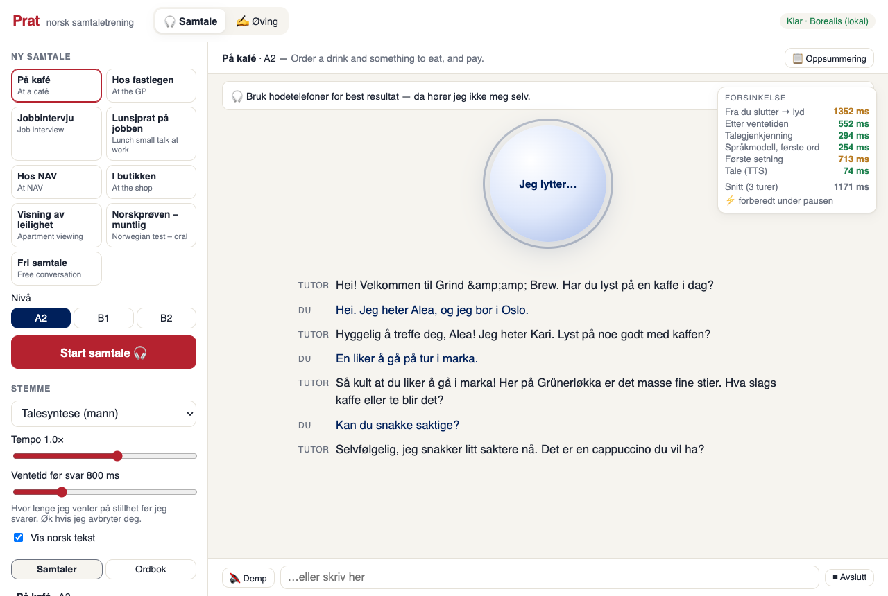

# Prat — norsk samtaletrening

A local, offline **spoken Norwegian conversation partner**: you just talk, it listens, waits
for you to finish, answers out loud in about a second, and stops when you interrupt it.
It's built to the Notion spec *Norwegian Voice Tutor*; see [SPEC.md](SPEC.md) for how each
requirement was met, the measured latencies, and the deviations.



## Quick start

```bash
./run.sh            # first run downloads ~5 GB of models, then open http://127.0.0.1:8000
```

Then press the orb and talk. **Use headphones** for the best results. Requires
[uv](https://docs.astral.sh/uv/) and an Apple-silicon Mac (MLX). Chrome is recommended
(for its echo cancellation).

## Two modes

**🎧 Samtale (live)** — hands-free conversation, as in the spec:
- Silero VAD and adaptive end-of-turn detection. It waits longer when you trail off ("…og", "eh").
  **Ventetid før svar** sets the silence window live.
- NB-Whisper (MLX) → Borealis (streamed, with a prompt cache) → sentence chunker → Piper,
  with the work started *during* your pause so the reply is ready when the turn ends.
- **Barge-in:** start talking and it stops within ~0.1–0.2 s, and remembers only what you heard.
- **Voice commands:** "gjenta", "saktere" / "fortere", "forklar *ord*", "la oss øve på kafé / hos legen / NAV / jobbintervju…".
- A live transcript (tap a word for its meaning), a **latency panel** per turn, and a summary at the end.

**✍️ Øving (practice)** — push-to-talk or typed chat with explicit corrections (word diff), translation,
tap-a-word glossary, "💡 help me answer" suggestions, shadowing with a pronunciation score, and a word list.

## Configuration (env vars)

| Var | Default | |
|---|---|---|
| `PRAT_LLM` | `mlx` | `mlx` (local Borealis) · `claude` (practice mode only, needs `ANTHROPIC_API_KEY`) · `auto` · `scripted` |
| `PRAT_MLX_MODEL` | `NbAiLab/borealis-4b-instruct-preview-mlx-8bit` | `NbAiLab/borealis-12b-instruct-preview-mlx-8bit` on a 40 GB Mac; `models/borealis-4b-4bit` for low memory |
| `PRAT_STT_MODEL` | `FredrikKarlssonSpeech/nb-whisper-small-mlx` | `…-medium-mlx` is more accurate (~0.7 s on an M1 Pro) |
| `PRAT_END_MS` | `800` | default silence before the tutor answers |
| `PRAT_SPEED` | `0.9` | default speaking rate |
| `PRAT_VOICE` | `piper:talesyntese` | default voice id |
| `PRAT_CLAUDE_MODEL` | `claude-opus-5-5` | |
| `PRAT_DATA_DIR` / `PRAT_MODELS_DIR` | `./data` / `./models` | SQLite DB / Piper voices |

`./run.sh --host 0.0.0.0 --port 8000` to use it from a phone on the same network. Note that browsers
only allow the microphone on `localhost` or HTTPS.

## Layout

```
prat/
  live/         real-time pipeline: vad.py (Silero ONNX), turn.py (end-of-turn/barge-in),
                chunker.py, tutor.py (prompt, voice commands), session.py (orchestration)
  local_lm.py   Borealis on MLX: streaming + reusable KV prompt cache
  tts.py        Piper + MMS engines, voice registry, WAV cache
  stt.py        NB-Whisper on MLX
  llm.py        practice-mode tutoring tasks; Claude / Borealis / scripted backends
  scenarios.py  role-play scenarios and level descriptions
  scoring.py    shadowing word alignment
  store.py      SQLite: sessions, turns, vocab
  server.py     FastAPI API + static UI
web/            vanilla JS UI; live.js streams echo-cancelled mic audio and plays tutor chunks
tests/          pytest (fake engines, turn logic) + e2e/ (real models: live_client.py measures
                latency and barge-in; live_ui_smoke.py and ui_smoke.py drive a headless browser)
```

## Tests

```bash
uv run pytest                                          # fast unit tests, no models
./run.sh --port 8765 &
uv run python tests/e2e/live_client.py                 # real-time latency + barge-in report
uv run python tests/e2e/live_ui_smoke.py               # live mode in a headless browser
uv run python tests/e2e/ui_smoke.py                    # practice mode in a headless browser
```

## Known limitations

- **Echo with speakers is untested.** The browser's echo cancellation is used, but headless tests
  can't open a real mic. Use headphones until you've tried it on speakers.
- **Whisper smooths over inflection errors** ("koste" → "koster"), so the tutor can't recast those.
- **This dev machine has 16 GB.** With many apps open the system swaps and latency rises to 2 s or
  more; the 40 GB target won't have this problem.
- Practice-mode explanations are hidden with the local model (its corrections are good, its
  explanations often aren't).
